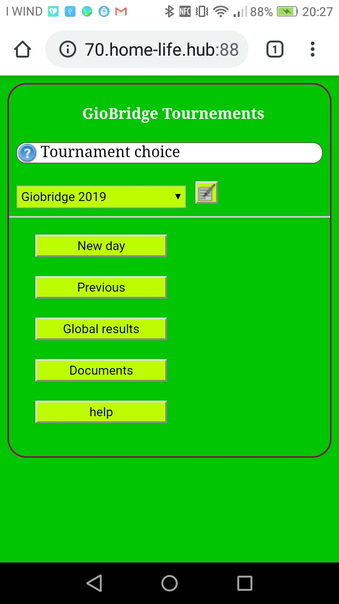

# GioBridge-Tournemens
This web app manages 4 or 5 player Bridge (Chicago) tournaments, maintaining long-term rankings. A tournament is divided into days, games and hands. The individual results of each day are accumulated in a global ranking by player. Useful at home and/or at Bridge Club.

For more infos see readme.txt (leggimi.txt in Italian).
Some  screenshot in images dir.

